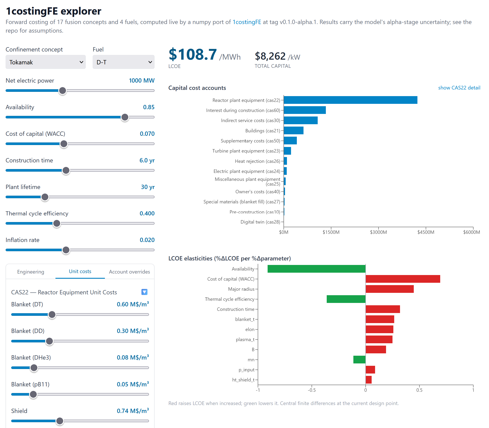
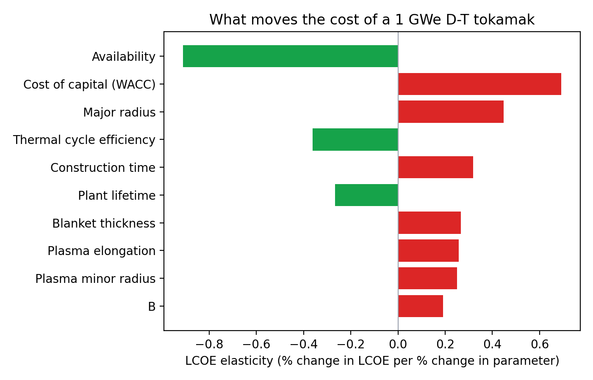

# Introducing 1costingFE: the open-source engine behind our numbers

Three posts by the 1cFE initiative have made concrete, checkable claims about the cost of fusion electricity. The [cost-floor post](https://1cf.energy/fusions-cost-floor-what-if-the-core-were-free/) asked what a fusion plant would cost if the core were free, and put numbers on the balance-of-plant floor for each fuel. The [direct energy conversion post](https://1cf.energy/direct-energy-conversion/) asked whether DEC moves that floor. The [pipeline post](https://1cf.energy/from-papers-to-plant-economics/) costed 38 fusion concepts in one automated pass. Every number in the first two posts, and the cost model under most of the concepts in the third (the exotica that fit no standard archetype got their own freeform treatment), came out of the same codebase.

This post hands you that codebase. [1costingFE](https://github.com/1cFE/1costingfe) is open source, pinned for this post at tag [v0.1.0-alpha.1](https://github.com/1cFE/1costingfe/tree/v0.1.0-alpha.1), and small enough to read in an afternoon. We want you to clone it, run it, and tell us where it is wrong.

## What it is

1costingFE is a costing framework. In: a confinement concept, a fuel, and a design point, the geometry that drives the component costs and the net electric power that fills the LCOE denominator. Out: a levelized cost of electricity, an account-by-account cost breakdown, and the closed power balance behind them. It is calibrated and traceable through the [account justification documents](https://github.com/1cFE/1costingfe/tree/v0.1.0-alpha.1/docs/account_justification): one document per cost account, recording what the number is calibrated against and where the uncertainty lives.

It is composed of three modules:

- **Economics.** Levelized cost of electricity with the details that are easy to get wrong: capital recovery at the cost of capital, interest during construction accrued over the build window, and operating costs treated as a growing annuity rather than a flat stream. Scheduled component replacements (blankets, divertors, laser drivers) are discounted into the O&M stream against fuel-dependent lifetimes.
- **Physics.** First-principles power partitioning for D-T, D-D, D-He3, and p-B11, including the secondary reaction chains that set each fuel's real neutron fraction. Radiation losses from bremsstrahlung, synchrotron, and impurity line radiation from sputtered wall material and seeded impurities. Power balances for both steady-state and pulsed concepts, including pulsed inductive direct energy conversion with explicit capacitor-bank round-trip losses.
- **Costing.** A bottom-up cost account framework: the standard fusion code of accounts introduced by [Schulte et al. (1978)](https://www.osti.gov/biblio/6635206) and carried forward by the ARIES program and by pyFECONS, a costing framework commissioned by ARPA-E. It covers every plant cost from [pre-construction and licensing](https://github.com/1cFE/1costingfe/blob/v0.1.0-alpha.1/docs/account_justification/CAS10_preconstruction_costs.md), through [buildings](https://github.com/1cFE/1costingfe/blob/v0.1.0-alpha.1/docs/account_justification/CAS21_buildings.md), [reactor plant equipment](https://github.com/1cFE/1costingfe/blob/v0.1.0-alpha.1/docs/account_justification/CAS22_reactor_components.md), [turbine plant and electrical](https://github.com/1cFE/1costingfe/blob/v0.1.0-alpha.1/docs/account_justification/CAS23_26_balance_of_plant.md), and [indirect costs](https://github.com/1cFE/1costingfe/blob/v0.1.0-alpha.1/docs/account_justification/CAS30_indirect_service_costs.md), down to [annual operations](https://github.com/1cFE/1costingfe/blob/v0.1.0-alpha.1/docs/account_justification/CAS70_staffing_and_om_costs.md), [fuel](https://github.com/1cFE/1costingfe/blob/v0.1.0-alpha.1/docs/account_justification/CAS80_annualized_fuel_cost.md), and [financing](https://github.com/1cFE/1costingfe/blob/v0.1.0-alpha.1/docs/account_justification/CAS90_annualized_financial_costs.md) (CAS10 through CAS90), with 18 reactor-plant sub-accounts (blanket, shield, magnets, heating, vacuum, power supplies, and so on) addressable by name. Every account can be overridden from user input (a vendor magnet quote, a bottom-up building estimate), with overridden accounts tracked in the output so framework defaults are always distinguishable from your numbers.

The current release covers 17 confinement concepts across steady-state magnetic, pulsed magneto-inertial, and inertial families, and all four fuels.

## Try it live

The quickest way to get a feel for the model is the [live explorer](https://1costingfe-explorer.vercel.app). Pick a concept and a fuel, drag the sliders, and watch the LCOE, the account breakdown, and the sensitivity tornado recompute as you drag; an advanced panel exposes the engineering parameters, the unit-cost constants, and per-account M$ overrides. It is not a lookup table: a numpy port of the model runs on every input change, parity-tested against the original at 74 reference points.

Treat it as the appetizer. The explorer shows one design point at a time through a curated set of knobs; the interesting functionality, exact autodiff sensitivities, vectorized parameter sweeps, plant-size-aware override scaling, multi-module plants, and the full scriptable API, lives in the library, which is what the rest of this post is about.



## Install and run

The library is one command away:

```bash
pip install 1costingfe
```

For the full experience (the example scripts, the account justification documents, the tests), clone at the tag and install editable instead:

```bash
git clone --branch v0.1.0-alpha.1 https://github.com/1cFE/1costingfe
cd 1costingfe
pip install -e .
```

The whole user surface is one call:

```python
from costingfe import CostModel, ConfinementConcept, Fuel

model = CostModel(concept=ConfinementConcept.TOKAMAK, fuel=Fuel.DT)
result = model.forward(
    net_electric_mw=1000.0,
    availability=0.85,
    lifetime_yr=30,
)

print(f"LCOE: ${float(result.costs.lcoe):.1f}/MWh")
print(f"Total capital: ${float(result.costs.overnight_cost):,.0f}/kW")
subaccounts = {
    k: v for k, v in result.cas22_detail.items()
    if k != "C220000" and not k.startswith("C220106_")
}
for code, value in sorted(subaccounts.items(), key=lambda kv: -kv[1])[:5]:
    print(f"  {code}: ${float(value):.0f}M")
```

which prints, on a fresh install:

```
LCOE: $85.3/MWh
Total capital: $6,048/kW
  C220103: $515M
  C220101: $424M
  C220111: $285M
  C220102: $284M
  C220104: $279M
```

That is a 1 GWe D-T tokamak at 85% availability over a 30-year life; the capital figure includes interest during construction and is quoted per kW of net capacity. The five largest reactor-plant items are the magnets (C220103), the blanket and first wall (C220101), installation labor (C220111), the shield (C220102), and heating and current drive (C220104). The returned object also carries the full power balance from fusion power to grid, every intermediate parameter by name, and the set of accounts your inputs overrode.

Swap the two enums and the same call costs a pulsed FRC burning D-He3 or a laser IFE plant burning D-T. The `examples/` folder has 26 scripts, including the ones that reproduce the numbers in the cost-floor and DEC posts, and the per-account justification documents live in `docs/account_justification/`.

## Plugging in your own numbers

If you work on fusion, there is probably one piece of this plant you know better than we do: a vendor quote for magnets, your own bottom-up model of a blanket, a better price on a breeder material. The framework is built so that knowledge can be grafted in at the right level, with the rest of the plant recomputing around it. There are three levels, depending on what you have.

**You have a better design point.** Every concept's engineering parameters live in a YAML defaults file (`src/costingfe/data/defaults/steady_state_tokamak.yaml` and sixteen siblings), and any of them can be overridden per call:

```yaml
b_center: 12.0       # Field at coil center [T]
R0: 3.0              # Major radius R0
plasma_t: 1.1        # Minor radius a
elon: 3.0            # Elongation kappa
blanket_t: 0.80      # Blanket thickness
f_GW: 0.85           # Greenwald density fraction
```

**You have a better unit cost.** The cost model itself is parameterized in one shared `costing_constants.yaml`: material prices, fabrication markups, per-MW bases, each with its provenance in a comment and a longer story in the matching justification document. If you know what REBCO or PbLi actually costs this year, this is where your number goes, and it flows through every volume and mass the model computes:

```yaml
blanket_unit_cost_dt: 0.60           # Full breeding blanket (TBR>1.05)
coil_cu_price_per_kg: 11.0           # copper conductor $/kg (LME 2026 class)
coil_cu_fab_markup: 3.5              # winding, insulation, cooling, jointing, test
```

**You have a complete cost for a component.** A quote, or your own component model's output. Then you do not want our model of that component at all: pin the account to your number with `cost_overrides`, and the framework bypasses its own estimate for that account while everything else recomputes around yours.

All three levels share one call:

```python
result = model.forward(
    net_electric_mw=1000.0,
    availability=0.85,
    lifetime_yr=30,
    blanket_t=1.0,                      # design point: thicker blanket [m]
    blanket_unit_cost_dt=0.45,          # unit cost: cheaper breeder [M$/m^3]
    cost_overrides={"C220103": 480.0},  # account pin: vendor magnet quote [M$]
)

print(f"LCOE: ${float(result.costs.lcoe):.1f}/MWh")
print(f"Overridden accounts: {result.overridden}")
```

```
LCOE: $84.6/MWh
Overridden accounts: ['C220103']
```

Pinned accounts are reported in `result.overridden`, so any result can be audited for which numbers are the framework's and which are yours. If your quote is for a different plant size, `override_reference_mw` rescales it to the target power by that account's own scaling law. And a typo in any override name is rejected with a did-you-mean suggestion rather than silently ignored.

The three tabs in the explorer's advanced panel are exactly these three levels, so anything in the snippet above can also be done with sliders.

## The differentiable part

1costingFE is built on JAX, which means the same code that computes an LCOE also computes its derivative with respect to every input at once:

```python
s = model.sensitivity(result.params)
for key, e in sorted(
    {**s["engineering"], **s["financial"]}.items(), key=lambda kv: -abs(kv[1])
)[:8]:
    print(f"{key:24s} {e:+.2f}")
```

```
availability             -0.89
interest_rate            +0.65
R0                       +0.40
construction_time_yr     +0.30
elon                     +0.29
eta_th                   -0.28
blanket_t                +0.25
plasma_t                 +0.20
```

These are elasticities: percent change in LCOE per percent change in the parameter.



The chart says something worth pausing on: the two strongest levers on fusion electricity cost at this design point, availability and the cost of capital, are not physics parameters. The physics levers (major radius, elongation, blanket thickness) matter, but they queue up behind the boring ones.

The elasticity vector is also the discipline that keeps a model like this honest. A costing framework with enough free parameters can be tuned to produce any answer you like, and in a field where calibration data is sparse, that is a real failure mode. Differentiability makes the knobs visible: if a parameter has near-zero elasticity, calibration effort spent on it is wasted, and if a result depends on a parameter nobody can defend, the tornado chart will say so.

## Where this sits in the landscape

The established open systems codes, [PROCESS](https://github.com/ukaea/PROCESS), [bluemira](https://github.com/Fusion-Power-Plant-Framework/bluemira), [FUSE.jl](https://github.com/ProjectTorreyPines/FUSE.jl), and [FAROES](https://github.com/PlasmaControl/FAROES), go far deeper on tokamak engineering than we do, and remain the right tools for a detailed D-T tokamak design study. [pyFECONS](https://github.com/woodruff-scientific-ltd/pyfecons) and its [CATF extension](https://arxiv.org/abs/2602.19389) span concepts and fuels as parameterized cost models, with the physics encoded in the inputs rather than the model. What no existing open tool offers is the intersection 1costingFE was built for: aneutronic fuels and DEC, steady-state and pulsed concepts, concept-aware physics, and autodiff sensitivity in one call. The [methodology paper](https://github.com/1cFE/1costingfe/blob/master/docs/papers/1costingfe_paper/1costingfe_paper.pdf) (a working draft, PDF in the repo) and the per-account justification documents are the methodology reference.

## What is shaky

This is an alpha, and the honest list is short but real.

The deepest item is structural: the framework takes power and geometry as two separate inputs. Geometry drives the component costs; power sets the LCOE denominator. A costing framework has no business pretending to know every concept's internal physics well enough to derive one from the other, so nothing enforces that the geometry you specify can actually deliver the power you ask for. We lean on published design points, where the concept's developers have already done that work; the [fusion-tea](https://github.com/1cFE/fusion-tea) pipeline ingests them.

Beyond that: the building and tritium-plant scope for aneutronic fuels is calibrated against thin reference data, because few aneutronic reference designs exist to calibrate against. And pulsed inductive DEC is physically modeled but has never been validated at reactor scale by anyone, so treat its efficiency defaults with the same skepticism we urged in the DEC post. We would rather be corrected than deferred to on all of it.

## An invitation

In rough order of how much it helps us:

1. **Reference cost data.** If you have real numbers for any account, magnet costs at current REBCO prices, balance-of-plant from recent fission or combined-cycle projects, capacitor pricing at relevant duty cycles, we want them. Anonymized is fine; sourced is better.
2. **Account-level review.** Pick one file in `docs/account_justification/`, read it, and tell us where it is wrong. Specific beats general.
3. **Validation cases.** A published design with a full cost breakdown that we cannot reproduce by overriding the relevant accounts is a case we want to study.
4. **Bug reports.** [GitHub issues](https://github.com/1cFE/1costingfe/issues). We respond.

Play with the [explorer](https://1costingfe-explorer.vercel.app). Clone the [repo](https://github.com/1cFE/1costingfe). Run the examples. The 423 tests pass, the numbers in our posts regenerate from the example scripts, and the fastest way to make the model better is for someone outside the project to find the place where it is wrong.
