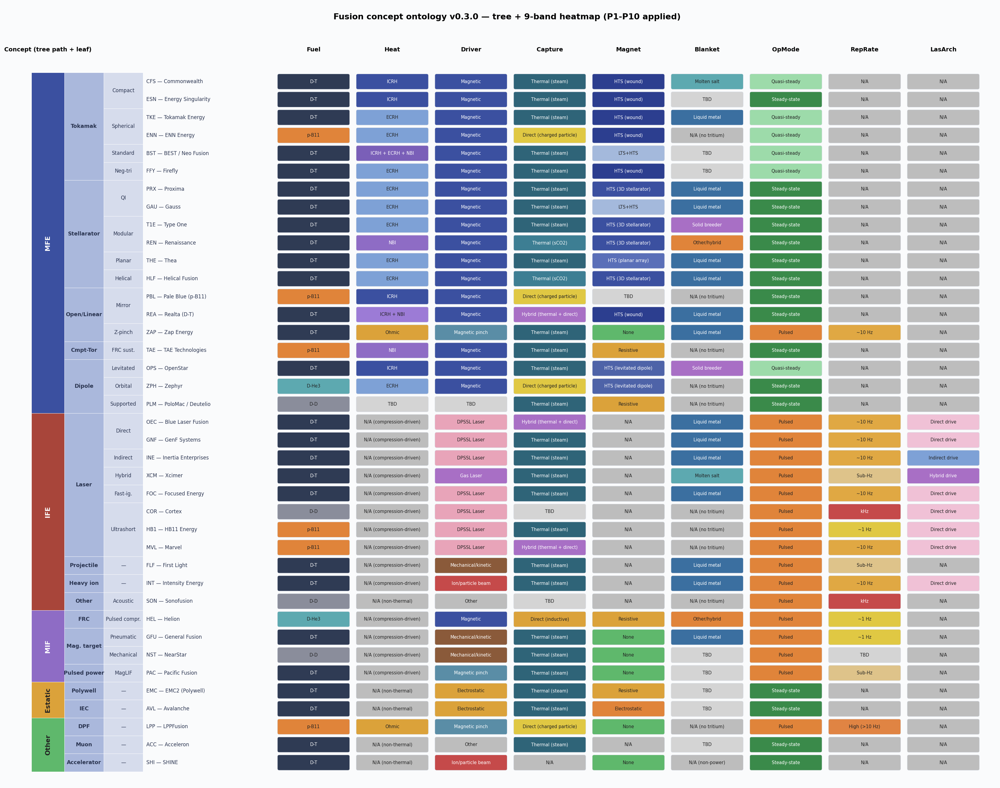
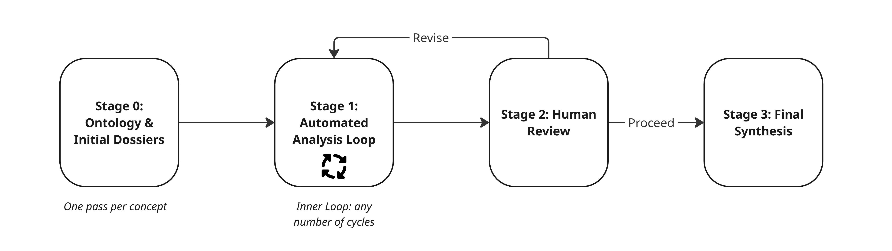
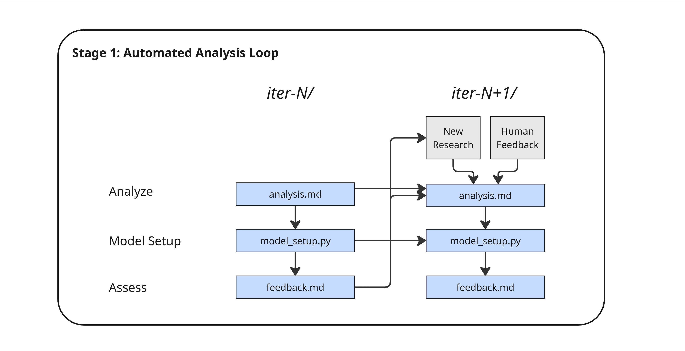
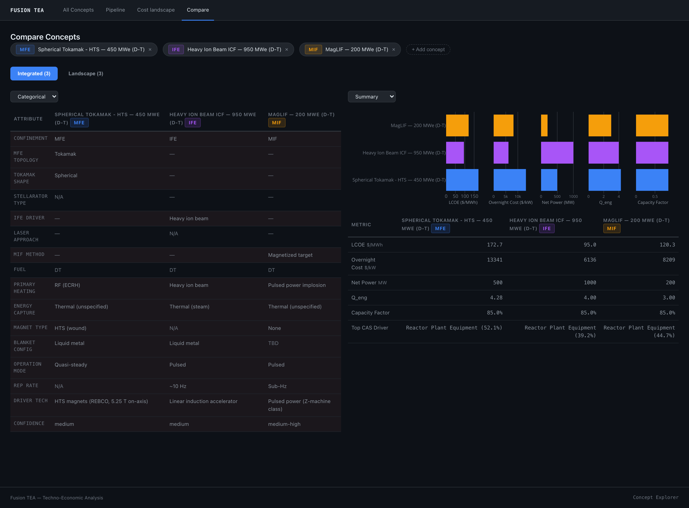
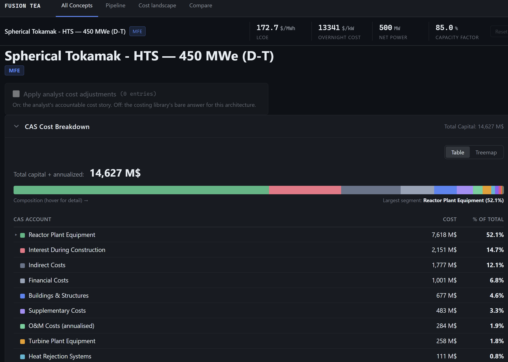
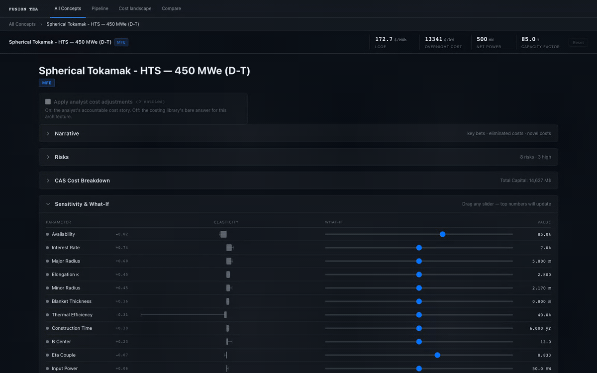

# Using the pipeline

Post Title: From Papers to Plant Economics: Costing 38 Fusion Concepts in One Pipeline
Target Date: May 14, 2026
Status: In Review
Lead Author: Mallory Snowden, Reid, Tal Rubin
Type: Milestone
Workstreams: WS2 TEA Engine, WS3 Costed BOM
Assets Needed: Code release (alpha), worked example with input-to-output walkthrough, sensitivity tornado chart or waterfall for one concept, optional video walkthrough of running the pipeline
Internal Dependencies: TEA v0.1 runs on at least one reference concept. Cost and power balance close without hand edits.
Risks: False precision. Readers fixating on numbers. Mitigate by publishing ranges only, labeling fidelity and evidence clearly.

# Introduction

We have built and run an automated pipeline that takes 38 fusion reactor concepts, from established tokamaks to early-stage and exotic ideas, and turns each one into a researched dossier, a cost model, and an LCOE estimate within a single framework.

The mission of 1cFE is to understand what must be true for fusion energy to reach a levelized cost of electricity at or below $0.01/kWh. Answering that requires a map of the full design space, not just the approaches with the most published data. The concepts in this first pass were selected for technical distinctiveness and commercial seriousness. If you believe we are omitting a promising approach, please [contact us](https://1cf.energy/contact/).

Other resources, such as [Fusion Energy Base](https://www.fusionenergybase.com/), have compiled similar concept landscapes. We are not aware of any that integrates agentic research and deterministic costing into a single reproducible pipeline, which is the gap this work addresses.

The pipeline pursues four goals: a common ontology so every concept is described by the same set of characteristics; a structured analysis of each concept covering what is novel, which hypotheses the cost model should test, and how the biggest risks and assumptions are captured (sensitivities, scenario branches, or explicit flags); a costing model for each concept built on the deterministic framework of [1costingFE](https://github.com/1cFE/1costingfe) where possible; and tools for exploring the results and building intuition.

As a first major deliverable of our project, we seek to build and formalize an understanding of ~40 different fusion reactor concepts. These concepts were selected for consideration due to their technical distinctiveness and commercial seriousness. If you believe that we are omitting a promising fusion approach, please [contact us](https://1cf.energy/contact/). 

Given the volume of concepts and information to process, we took an AI-centric approach. That choice introduces specific challenges to design around:

- Reliably automating research and data extraction
- Enabling traceability and verification to mitigate hallucinations
- Keeping a level playing field so that, to the extent possible with varying amounts of public data per concept, comparisons stay apples-to-apples
- Incorporating human review, feedback, and management
- Treating each analysis as living: none of these are "done," and any analysis should be able to absorb new data as it arrives

<aside>
🚧

**Caveat:** We are still auditing these concepts against public information. Every value in the database carries uncertainty, all results are predicated on the underlying physics of each concept working as intended, and the figures shown are the pipeline's outputs at our stated assumptions, not forecasts of any company's plant and not any company's own numbers. We publish at this stage because external scrutiny improves the work. The single best thing a reader can do is find an error and tell us.

</aside>

## Pipeline and Process

### Building an Ontology

In this phase we ran a brute-force research cycle to gather enough data on each concept to complete the ontology table below with moderate confidence, producing an initial dossier per concept.

### Automated Analyses

At the highest level, the pipeline looks like this: 

**Stage 0** is the ontology and dossier work above. That data seeded the cold-start Stage 1 run.

**Stage 1** is an iterative cycle. Each iteration is kicked off using the agentic feedback produced by the prior cycle, optionally new data sources (from our research agent or provided by the user), and optionally specific feedback from the user.

After any number of iterations, a human can review three artifacts:

- [`analysis.md`](http://analysis.md) :  the structured concept report
- `model_setup.py`: the cost model
- `model_output.txt`: results of running the model, including LCOE and sensitivity data

**Stage 2:** The user approves the analysis or provides feedback and continues iterating.

**Stage 3:** Once approved, a final command produces a unified synthesis, including comparison across concepts.

We built the agentic layers on Claude, which gave us a single stack for research, code generation, and orchestration. To operate the workflow efficiently we deployed a `/manage-concepts` agent.

The analysis loop (`run_analysis.py`) takes a few flags:

- `--add-passes N` : run for another N loops autonomously
- `--research`: insert an agentic research process at the start of the cycle; the agent uses the previous iteration's `feedback.md` to target gaps
- `--feedback PATH`: point at a feedback file, either custom or generated from Stage 2

A few design patterns proved useful for this style of iterative agentic process:

- **The filesystem is the state machine.** Where we are in the process is dictated fully by what files exist on disk. You can run the `run_analysis.py` script an any time, and it will pick up where left off.
- **Composable prompts.** Since file presence indicates state, we were able to utilize simple `{{var}}` substitution, `{{#if var}}` conditionals, and `{{@path}}` file inclusion in our prompts to keep control code minimal.
- **Iteration directories as transcripts.** Every loop pass writes a complete new directory. Provides full record of how analysis evolves over time. Undoing work is as simple as deleting a directory.

### Worked Example

The clickable image below walks through the full Automated TEA Pipeline using a compact spherical tokamak based on Tokamak Energy’s ST-E1 design.  This interactive walkthrough serves to illustrate source selection, dossier synthesis, the research gaps that require human intervention, and the final LCOE and sensitivity results.  Note that all costing values have a high degree of uncertainty and are predicated on the **underlying physics of each concept working as intended.**  The complete pipeline database is available in the Concept Explorer, which is covered in the following section**.**

](walkthru.png)

[https://1cfe.github.io/fusion-tea-walkthrough-visualization/](https://1cfe.github.io/fusion-tea-walkthrough-visualization/)

Two framing notes apply here and throughout the database. First, these are our model's outputs at a single published design point under our stated assumptions, including 1 GWe normalization. They are not Tokamak Energy's numbers, and differences from any company's internal estimates are expected. Second, as with everything in this analysis, the results assume the concept's underlying physics performs as intended. In keeping with our living-analysis approach, we welcome corrections from any team whose concept appears in the database, including pointers to better primary sources or design points.

## Concept Explorer

The Concept Explorer is a tool for inspecting the results of the automated analyses. It supports side-by-side comparison of all concepts in the database, plus agentic research insights, cost breakdowns, and the key sensitivities of each design. It is an alpha release that we expect to improve with user feedback.

Three confinement families compared at a normalized 1 GWe plant scale: a spherical tokamak, a heavy ion beam inertial concept, and a magnetized target concept

A hosted, no-install version of the Concept Explorer is in development. The local alpha is for readers who want to dig in now, and feedback from early users will directly shape the web release

#### Setup

To run the Concept Explorer locally:

- Follow the [README.md](https://github.com/1cFE/fusion-tea/blob/main/README.md) to clone (at least) `fusion-tea` and `1costingfe` side-by-side
- Install `uv` and run `uv sync`
- `cd ~/1cfe/fusion-tea`
- `uv run python exploration/concept_explorer/server.py`

The server will run on `http://localhost:8421`. See the [concept-explorer/README.md](https://github.com/1cFE/fusion-tea/tree/main/exploration/concept_explorer) for more. 

#### Results

LCOE results, sensitivity analyses, and key findings from the agentic research can be viewed by selecting any concept. 

A concept becomes eligible for approval once it has passed strategic review (Review-Status in {proceed, addressed, clean}) and a `synthesis.md` file has been generated. A human expert then formally approves it by running `scripts/run_analysis.py approve <id>`, which writes `Status: approved` and `Approved-Date` to the front matter of both `analysis.md` and `synthesis.md`. Approval has one downstream side effect being aware of: approved concepts enter the cross-concept reuse pool, so their assumptions become reference material the agent pulls into subsequent `analyze` runs.

The images below provide a preview of the Concept Explorer UI, but to fully explore and interact with individual concepts, it is best to follow the instructions in the Setup section above.

One concept's full cost picture: headline metrics and the ranked CAS breakdown

Every result ships with elasticities. Drag any assumption and the headline updates live; slider bounds and population whiskers come from each parameter's assumed range

## What We Are Seeing So Far

Three category-level observations from the first full pass over the concept landscape. 

1. **Uptime and the cost of money are the only universal levers.** Only two parameters rank near the top of the sensitivity tables for nearly every concept, and neither is physics: availability is the most sensitive input for 29 of 38 concepts, and interest rate makes the top five for 33 of 38, both with elasticities near one. The physics levers rotate family by family: major radius and field strength for magnetic confinement, repetition rate and driver parameters for inertial. These elasticities are local to each design point under our 1 GWe normalization, which disadvantages concepts that scale geometrically rather than by replication.
2. **For roughly half the concept landscape, the economics rest partly on our assumptions.** Seven of 38 concepts have no published quantitative design point at all. For another 13, the engineering gain that sets recirculating power is a library default rather than a value derived from the concept's published physics. We model these concepts anyway, but we suppress ungrounded headline LCOEs and flag default-driven inputs rather than print artifacts of our own library. This measures where fusion's public record runs out; it is not a finding about any concept's design.
3. **The recurring failure modes were source problems, not arithmetic problems.** Concepts typically took two to three iterations to pass review, and what forced another pass was almost always upstream of the cost model: design points stitched from publications that disagree, library defaults silently carrying the economics, cost anchors imported from older studies of different architectures, and small attribution slips. The deterministic costing layer rarely failed. The hard part is establishing what a concept actually claims; every catch and fix is recorded in the iteration history.

## Validation Steps

Validation is built into the process rather than bolted on at the end. Our team ran targeted deep-dive spot checks comparing expert technoeconomic analyses against the AI-generated LCOE results. Those checks surfaced a meaningful number of misapplied model inputs from the concept research, exactly the failure mode we expected from LLM-based research agents, and drove iteration cycles that substantially strengthened the research-derived inputs through two changes:

- **Single-design-point anchoring.** Each concept's primary sources are now anchored to one consistent design point, rather than combining elements from multiple design points.
- **A tighter override process.** Cost and performance overrides are applied only when supported by high-quality data and a clear, well-justified rationale that the concept differs materially from the baseline costing model's assumptions.

Validation efforts are ongoing. The spot checks are aggregated [here](https://github.com/1cFE/fusion-tea/tree/main/exploration/concept_analysis/validation_reviews) for transparency.

## Known Limitations

1. **Modularity scaling penalty.** All plant designs are scaled to 1 GWe for an apples-to-apples LCOE comparison. Smaller plants scale by replicating modules, which can inflate LCOE because many reactor-core costs scale approximately linearly with capacity. One large tokamak will typically require less HTS conductor than the equivalent fusion capacity distributed across multiple smaller modules, since larger reactors benefit from favorable surface-area-to-volume scaling. As a result, smaller plant designs tend to be disadvantaged by the 1 GWe normalization, though this still provides a fairer comparison than evaluating each concept at its native power level.
2. **Freeform codegen analyses.** Exotic concepts that fit no 1costingFE archetype bypass the standardized cost model, so their outputs are not directly comparable with archetype-based runs. These concepts are flagged "Non-Standard" to signal that their LCOEs come from a different methodology and carry greater uncertainty and reduced comparability.
3. **Limited physical consistency checks.** [1costingFE](https://github.com/1cFE/1costingfe), relies on accurate inputs, and the agentic research can occasionally misattribute values. Basic sanity checks exist on power balance and efficiency attributes, but a physics-driven check of reactor dimensions against claimed power output is out of scope. This can distort LCOE values for certain concepts.

## Next Steps

The research data compiled for each concept will now be systematically analyzed to down-select the five to ten most promising concepts for deeper evaluation. An upcoming 1cFE post will set out the down-select criteria and the resulting subset. Those concepts will receive closer scrutiny: plant physics modeling upgrades, uncertainty bounds, and corridor mapping to ultra-low-cost fusion scenarios.

In the meantime, the Concept Explorer captures a broad range of fusion technologies with enough first-order detail to enable meaningful comparison. We encourage readers to explore, challenge, and stress-test the results. AI enables rapid analysis across a large design space, but expert review and community feedback remain essential for catching errors, refining assumptions, and improving the underlying research. If you find a problem, that is the tool doing its job: tell us, and the analysis gets better.