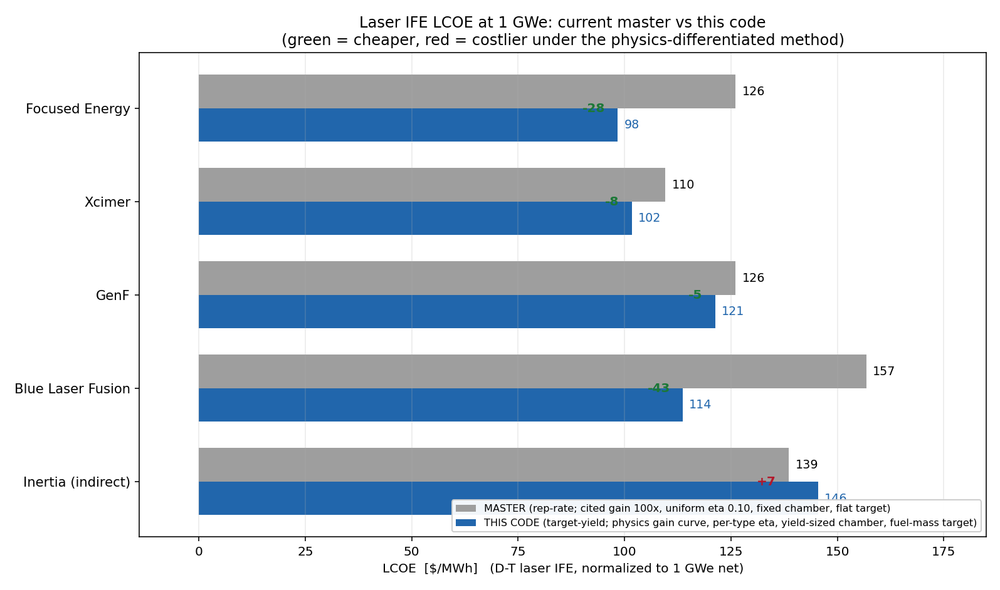

# Target-yield sizing for IFE/MIF — methodology and why it improves on master

Branch: `feature/target-yield-sizing`. Scope of the worked example below:
**D-T laser IFE** (Focused Energy, Xcimer, GenF, Blue Laser Fusion, Inertia); the
same axis also serves MagLIF and Z-pinch.

---

## 1. The problem this solves

To compare fusion concepts you must put them on a **common electrical scale**
(here 1 GWe net). Master sizes a laser plant on a **rep-rate axis**: it fixes the
vendor's *cited shot* (`e_driver`, `yield_per_shot`, hence a fixed cited gain
`G = yield/e_driver`), solves the repetition rate `f_rep` to hit the power
target, and **replicates identical chambers** (`n_mod`) if one chamber can't
reach it. That is a legitimate way to build a plant, but as a *comparison* tool
it has structural blind spots — every one of which is a physics quantity held
constant across concepts:

- **Gain is an asserted constant.** `G` is whatever `yield/e_driver` you type in,
  identical (≈100×) for every concept. It does not depend on the operating point
  and is never bounded by burn-up physics — master would accept a
  thermodynamically impossible gain.
- **Drive configuration is not represented.** Direct, hybrid, and indirect drive
  differ physically in how efficiently the driver couples energy into the fuel
  (coupling ≈ 1.0 / 0.75 / 0.5) — a first-order (~2×) gain difference. Master has
  no coupling concept, so all three ride the same asserted gain and an
  indirect-drive concept looks as good as a direct-drive one.
- **The chamber is a fixed input**, decoupled from the shot: per-shot yield does
  **not** propagate to first-wall/blanket capital. High yield-per-shot is
  effectively free — biasing the low-rep/high-yield corner.
- **Wall-plug efficiency is uniform** (η = 0.10 for all laser types), so KrF,
  DPSSL, and fiber lasers are treated as equally efficient.
- **Target cost is a flat `$/shot`** independent of target size.

The consequence is that master's laser-IFE ranking is driven mostly by the two
numbers it lets you assert (cited gain, flat target) plus driver `$/J`, while the
physics that actually distinguishes these concepts — drive-mode gain, wall-plug
efficiency, shot-scaled chamber and target — is invisible.

---

## 2. The method

**Philosophy: the company sets the driver, physics sets the gain.** We take each
vendor's *engineering* choices (driver technology, wall-plug efficiency, rep
rate, wall type — dry solid vs thick-liquid protective wall — and drive
configuration) as inputs, and let first-principles physics
determine the gain, the operating point, and the derived costs. Sizing is a
deterministic solve, not an LCOE optimizer.

### 2.1 Single-chamber scale-to-power
At fixed net power (1 GWe) and the concept's **stated rep rate**, we grow **one**
chamber's delivered driver energy `E` until it reaches the target:

```
find E  such that  P_net(E, f_rep) = 1 GWe ,   n_mod = 1
```

`P_net` is monotone in `E`, so this is a single bisection. There is no driver
ceiling: laser capital is priced as `$/J × E` (pure `$/J`, no per-unit fixed
term), so whether the energy is one large driver or many stacked beamlines is a
packaging detail the cost model cannot see. The honest scale penalty is carried
by the **chamber** (§2.4) and the **target** (§2.6), not a hand-set limit. This
faithfully represents a low-rep/big-shot design (Xcimer) that master cannot.

### 2.2 Gain from a size-dependent burn-up curve
Gain is **not** asserted. It is computed from the burn-up fraction, which rises
with the compressed fuel areal density, which in turn rises with driver energy:

```
ρR(E) = ρR_ref · (E / E_ref)^{1/3}          areal density (hydro-equivalent scaling)
φ(E)  = ρR / (ρR + H_B),   H_B ≈ 6 g/cm²    D-T burn-up fraction (Fraley/Lindl)
Y(E)  = φ(E) · m_fuel · e_DT ,  m_fuel = (loading · E · coupling)
G(E)  = Y/E = φ(E) · loading · coupling · e_DT
```

All three constants are literature-grounded:
- `H_B ≈ 6 g/cm²`: Hawker 2020 eq 2.19; Thomas *et al.* Phys. Plasmas 31, 112708
  (2024) use the same `φ = ρR/(ρR+6)` form.
- exponent `1/3`: Hawker 2020 eq 2.20 (Tabak hydrodynamic equivalence — constant
  density/velocity as energy scales); independently, a fit to NRL direct-drive
  gain data (G 127 @ 1.3 MJ, 155 @ 3.1 MJ) gives `ρR ∝ E^{0.36}`.
- `ρR_ref = 2.0 g/cm² @ 2.5 MJ` (→ φ 0.25, G 94× at reference): the *middle* of
  the direct-drive D-T range — Xcimer's realistic HDD design achieves
  ρR ≈ 1.3–1.6 @ 4 MJ (~57×), NRL high-gain designs imply ρR ≈ 3–4 (~140×).

Over ρR ≈ 2–6 the `φ` form rises like `ρR^{0.6}`, reproducing the `G ∝ ρR^{2/3}`
scaling of Thomas 2024. Two physically important properties:
- **Self-consistent solve:** because §2.1 solves `E`, the gain is evaluated at
  the *solved* driver energy — `E`, `G(E)`, and `Y` agree at convergence.
- **Hard ceiling / sanity check:** `φ → 1` gives `G_max = loading·coupling·e_DT`
  = **374× for direct D-T** (100% burn-up). A claimed gain above this is
  impossible — the Inertia-style "375×" claim is flagged automatically.

The curve is **agnostic to laser technology** (KrF/DPSSL/fiber ride the same
curve — gain is target physics, not laser hardware). It reverts to a flat
`burn_fraction` if `ρR_ref` is unset (MagLIF/Z-pinch default).

### 2.3 Drive-mode coupling
`coupling` is the fraction of delivered energy that assembles the fuel — the
physical difference between drive configurations at equal burn-up:
`direct = 1.0`, `hybrid = 0.75`, `indirect = 0.5` (hohlraum X-ray conversion +
re-absorption). It multiplies the assembled fuel mass (hence gain). Indirect
drive therefore assembles less fuel per joule → lower gain → a *larger* driver to
hit 1 GWe → a larger, costlier target.

### 2.4 Chamber sizing (yield → capital)
The first-wall radius is derived from the per-shot yield, taken directly from
GEM's HAPL chamber (Sviatoslavsky *et al.*, FST 47, 535, 2005):

```
R_fw = max( R_fluence , R_power )
R_fluence = R_ref · sqrt( Y / (Y_ref · f_wall) ),   R_ref = 6.5 m @ Y_ref = 150 MJ
R_power   = sqrt( P_neutron / (4π · Γ_max) )         time-averaged wall-load floor
```

`f_wall` is the tolerable-fluence multiplier by wall type (dry 1, thick-liquid
~50). The **neutron wall-load floor** `R_power` closes a gap in the pure-fluence
scaling: a low-yield/high-rep concept would otherwise get an unphysically small
chamber carrying tens of MW/m². `R_fw` feeds the existing radial build
(blanket/shield/vessel → CAS27/C220101/C220106), so chamber capital now responds
to the shot.

### 2.5 Per-technology wall-plug efficiency and emergent q_eng
η is resolved from the laser type via the existing `η = η_source × η_couple`
framework (Nd:glass 0.02, KrF 0.10, DPSSL 0.15, fiber 0.20 — NOAK projections).
Efficiency then flows into the **emergent** engineering gain: the power balance
computes `q_eng = P_et / P_recirc` with `P_recirc ∝ E·f/η` — it is *not* an
assumed input. A less-efficient driver pays in recirculating power, not in a
number you type.

### 2.6 Size-scaled two-mode target cost
Per-shot target cost scales with the assembled fuel mass
`m_fuel = Y/(φ·e_DT)` (the same yield the chamber uses), against a universal
per-archetype reference — no per-concept knob:
- **Capsule** (laser): `cryo(∝m) + coat(∝m^{2/3}) + assembly`, calibrated to the
  NOAK anchor. Indirect drive adds a size-scaled **hohlraum** term.
- **Metal liner** (MagLIF/Z-pinch): `liner(∝m)·machining + RTL`.

---

## 3. The comparison at 1 GWe



Full assumptions at 1 GWe (this code; gain curve on):

| Concept | drive | η_pin | gain | E_drv (MJ) | Y/shot (MJ) | f_rep (Hz) | n_mod | R (m) | q_eng | LCOE |
|---|---|---|---|---|---|---|---|---|---|---|
| Focused Energy | direct | 0.15 | 99 | 2.9 | 287 | 10 | 1 | 3.0 | 5.0 | 98.4 |
| Xcimer | hybrid | 0.10 | 125 | 34.1 | 4247 | 0.70 | 1 | 4.9 | 4.4 | 101.7 |
| GenF | direct | 0.15 | 99 | 2.9 | 287 | 10 | 1 | 9.0 | 5.0 | 121.3 |
| Blue Laser Fusion | direct | 0.20 | 98 | 2.8 | 274 | 10 | 1 | 8.8 | 6.2 | 113.7 |
| Inertia (26/30) | indirect | 0.15 | 57 | 5.8 | 329 | 10 | 1 | 6.8 | 3.3 | 145.5 |

For contrast, master sizes **every** concept identically — gain 100×, E 2.5 MJ,
Y 250 MJ, f 6.39 Hz, n_mod 2, η 0.10, R 4.0 m — differing only via driver `$/J`
and a couple of manual overrides.

### Why each LCOE changed (master → this code)

- **Focused Energy 126 → 98 (−28).** Master's uniform η = 0.10 was too pessimistic
  for a DPSSL NOAK driver (0.15) — higher efficiency lowers recirculating power
  and lifts q_eng (5.0). The chamber is now *derived* from the shot (3.0 m
  thick-liquid) rather than a fixed 4.0 m, and it's one chamber, not two.

- **Xcimer 110 → 102 (−8).** Master gave it a cheap KrF driver *and* the uniform
  100× gain, which happened to net a low number. This code derives it honestly:
  the **gain curve** rewards its large solved shot (**125× at 34 MJ**, vs the
  flat 70× that had wrongly penalized it), which halves the driver — but it now
  *pays* for its faithful 0.7 Hz big-shot design (larger chamber, larger target).
  Similar number, but for physically correct reasons rather than coincidence.

- **GenF 126 → 121 (−5).** Efficiency gain (0.10 → 0.15) is largely offset by its
  disclosed **dry-wall** chamber (9 m), which the yield-based sizing now charges.

- **Blue Laser Fusion 157 → 114 (−43).** Master had no fiber-laser type, so it
  forced DPSSL *and* a 9 m chamber. This code represents the actual **fiber/blue
  architecture** — cheaper `$/J` and the highest wall-plug efficiency (0.20, →
  q_eng 6.2). Master simply could not model the technology.

- **Inertia 139 → 146 (+7).** Master credited it the uniform 100× gain. This code
  applies the **indirect-drive coupling** (0.5 → gain 57×), which forces a larger
  driver (5.8 MJ) and a **size-scaled hohlraum** target. Master over-credited
  indirect drive's gain; here it correctly lands worst.

**Pattern:** master's uniform assumptions were sometimes too *pessimistic*
(FE/GenF/BLF, where real efficiency is higher and fiber exists → this code
lower) and sometimes too *optimistic* (Inertia, where indirect coupling halves
the gain → this code higher). The method differentiates on physics rather than on
asserted, uniform inputs.

---

## 4. Sensitivity: what drives each model's ranking

Spearman rank correlation of LCOE with each lever (Monte Carlo, 1 GWe):

| Lever | master ρ | this code ρ |
|---|---|---|
| Cited gain (master) / ρR gain (ours) | **−0.69** (asserted, dominant) | −0.20 (physics-capped) |
| Rep rate | — (solved, no lever) | **−0.77** (dominant, chamber-driven) |
| Wall type | — (chamber fixed) | −0.33 |
| Target cost | **+0.48** (flat × many shots) | +0.09 (fuel-mass, cheap) |
| Driver `$/J` | +0.17 | +0.30 |
| Wall-plug efficiency | −0.14 | −0.27 |

Master's LCOE is run by two numbers you *assert* and hold uniform (cited gain,
flat target); this code's is run by *physical* levers that genuinely differ
between concepts (rep rate → chamber, wall type, efficiency), with a gain
sensitivity that is appropriately bounded by burn-up physics.

---

## 5. Honest limitations

- **The `ρR_ref = 2.0` anchor is a middle value.** It sits above Xcimer's single
  realistic design (~57×) and below NRL's aspirational 1-D gains (~140×);
  defensible for a NOAK screen but on the optimistic side of *demonstrated*
  performance.
- **Extrapolation risk on big shots.** The gain curve is anchored at 2.5 MJ; the
  large-shot concepts extrapolate off it (Xcimer ~14×). Its `$102` is the softest
  number in the set — mild because the exponent is `1/3`, but real.
- **`f_wall = 50` for thick-liquid is a calibration**, load-bearing for Xcimer
  only (the sole confirmed liquid-wall concept); the other four are dry.
- **Absolute LCOE runs high** (~$100–150) versus the historical design-study COEs
  (SOMBRERO $67, OSIRIS $56, LIFE ~$50–90). These are **relative screening
  numbers**, not cost predictions, on either method.

---

## 6. Opt-in / regression

Every piece is opt-in and calibrated to existing NOAK anchors — no new absolute
cost levels. `sizing_axis: target_yield` selects the axis; the gain curve is on
by default for laser via `ρR_ref_g_cm2` in the YAML and reverts to flat
`burn_fraction` if unset. Un-flagged concepts and the MFE path are byte-identical
to master. Full suite green (753 passed).
